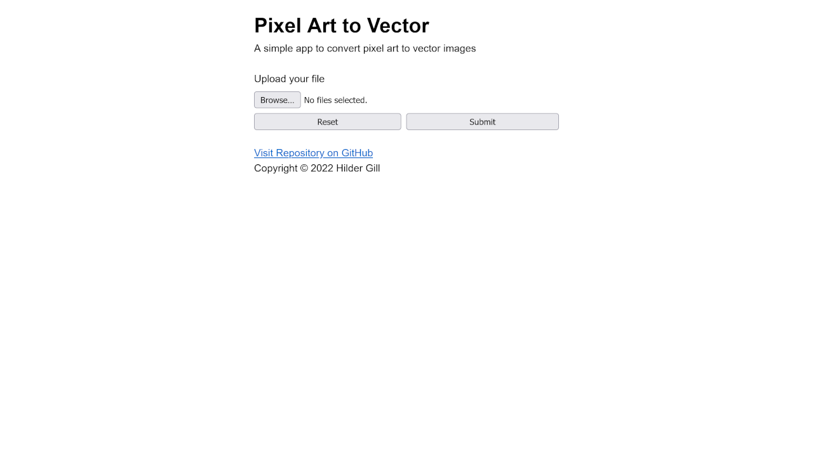
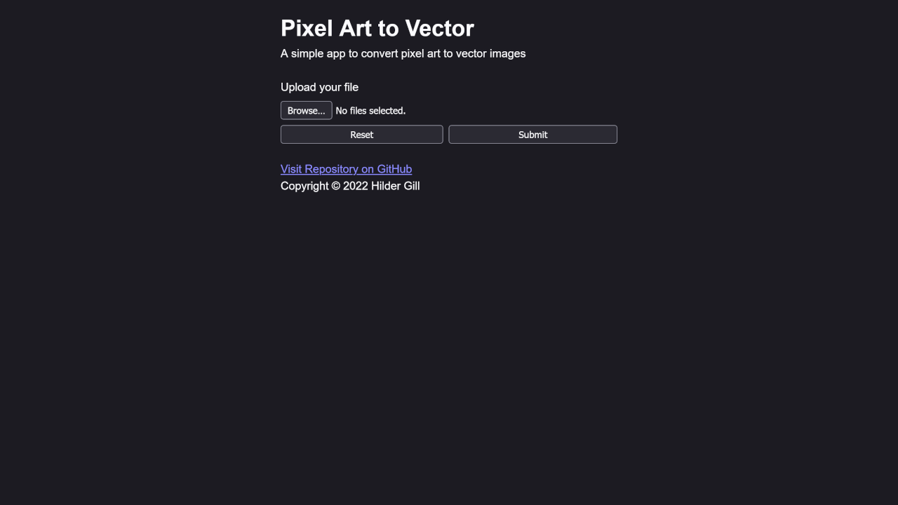

# Pixel Art to Vector (pixel-art-to-vector)

⚠️ **This project is still under development**




A simple app to convert pixel art to vector images

Built with:

-   [Vite](https://vitejs.dev)
-   [React](https://reactjs.org)
-   [TypeScript](https://www.typescriptlang.org)

Additional Credits:

-   [Prettier](https://prettier.io)
-   [Feather Icons](https://feathericons.com)

## Getting Started

Debugging pixel-art-to-vector:

```bash
# Using NPM
$ npm run dev [--port <port_number>]

# Using Yarn
$ yarn dev [--port <port_number>]
```

Building pixel-art-to-vector:

```bash
# Using NPM
$ npm run build

# Using Yarn
$ yarn build
```

## License

pixel-art-to-vector is licensed under [Apache 2.0](./LICENSE.txt)
